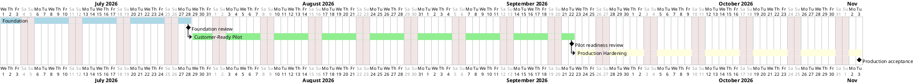

# Architecture Roadmap

This page restates the business-readable [Roadmap](https://robertvejvoda.github.io/fairspot/#/roadmap) as architecture outcomes, dependencies, and exit criteria.

## Architecture Phases

| Architecture Phase | Product Companion | Outcome | Exit Criteria | Dependencies | Status |
| --- | --- | --- | --- | --- | --- |
| Foundation | [Roadmap Phase 0-2](https://robertvejvoda.github.io/fairspot/#/roadmap) | Repository, CI, Booking core, supporting service integration, and operations baseline are established. | Core Booking slices and platform integration baseline are merged and documented. | CI, generated clients, Booking, Identity, Profile, Notification, Audit, Configuration. | Done |
| Customer-Ready Pilot | Current priority in [Roadmap](https://robertvejvoda.github.io/fairspot/#/roadmap) | FairSpot can be evaluated by HR/facilities, employees, customer IT, and operators under a hosted pilot profile. | GAP-001/002/003 have evidence or accepted residual risk; role-specific UX, DataHub projections, hosted smoke, and contract evidence are visible. | Durable customer state, DataHub inbox/projections, NAS/Cloudflare profile, WAF/auth smoke, role-centered UI. | In progress |
| Production Hardening | Production Handoff milestone | Pilot evidence becomes repeatable client-owned production guidance. | Restore drills, conformance evidence, operational runbooks, observability evidence, and support boundaries are accepted. | Customer-ready pilot evidence, backup/restore proof, monitoring, deployment profile validation. | Planned |

## Release Checkpoints

Release checkpoints validate a concrete branch against the architecture roadmap. They do not replace architecture phases or work packages.

| Release | Architecture Phase | Validation Outcome | Architecture Evidence | Exit Criteria |
| --- | --- | --- | --- | --- |
| `Release 1` | Customer-Ready Pilot | Current `master` can be tested as a hosted evaluation baseline, with fixes tracked on `release/1` and merged back when accepted. | [Readiness](/architecture/implementation-migration/readiness), [Work Packages](/architecture/implementation-migration/work-packages), [Risk Register](/architecture/architecture-states/risk-register), [Roadmap](https://robertvejvoda.github.io/fairspot/#/roadmap?id=release-validation-model). | Smoke evidence, readiness updates, known gaps, and accepted residual risks are recorded before tagging or merging the release branch back to `master`. |

## Active Architecture Priorities

| Priority | Architecture Outcome | Closes / Supports |
| --- | --- | --- |
| Durable customer and service state | Restart-safe tenant readiness and authoritative service data. | GAP-001 |
| DataHub first projections | Event-fed read models for booking outcomes, tenant readiness, HR/admin views, and reports. | GAP-002 |
| Hosted public-domain evidence | NAS/Cloudflare/WAF/auth/no-internal-exposure smoke evidence. | GAP-003 |
| Role-centered UX validation | Employee, HR/facility, admin, auditor, sponsor, and operator entry points are understandable. | GAP-004 |
| Contract evidence consolidation | Generated/source-of-truth APIs and event ownership are discoverable. | GAP-007 |

## Related Views

| View | Use When | Example |
| --- | --- | --- |
| Roadmap View | A reader needs to see architecture phases, timing assumptions, milestones, and readiness gates. | [Roadmap Gantt Chart](#example-roadmap-gantt-chart) |
| Transition State View | A reader needs to see how roadmap phases move the architecture between baseline, transition, and target states. | [Transition State Timeline](/architecture/architecture-states/transition-architectures?id=example-transition-state-timeline) |

## Example Roadmap Gantt Chart

